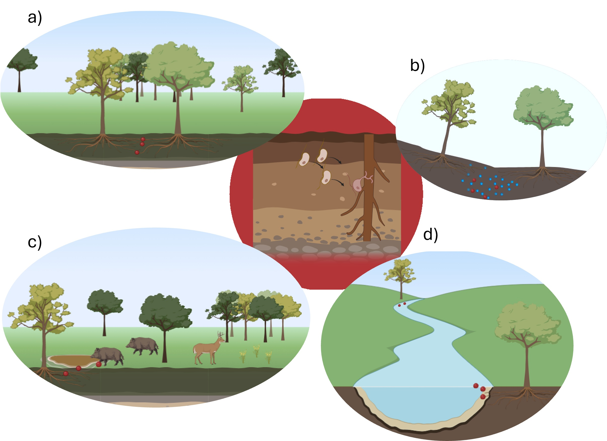

<!-- README.md is generated from README.Rmd. Please edit that file -->

```{r, include = FALSE}
knitr::opts_chunk$set(
  collapse = TRUE,
  comment = "#>",
  fig.path = "man/figures/README-",
  out.width = "100%"
)
```

# phytorisk

<!-- badges: start -->

[](https://CRAN.R-project.org/package=phytorisk) [](https://lifecycle.r-lib.org/articles/stages.html#experimental) [](https://www.gnu.org/licenses/gpl-3.0) [](https://www.repostatus.org/#active)

<!-- badges: end -->

`phytorisk` is an R package developed to quantify the risk of invasion of the oomycete *Phytophthora cinnamomi* Rands (Pc hereafter). Pc is a pathogen that infects plant's roots, and in many cases, kills the host. The dispersal of the pathogen depends on multiple factors, which are depicted in the next figure:

{#fig-dispersal width="825"}

a)  Movement of inoculum in the field due to diffusive root-to-root contact `mec_rootcontact()`

b)  Inoculum movement to roots in water particles within soil `mec_soilwater()`

c)  Dispersion of inoculum by domestic and wild animal movement `mec_zoospread()`

d)  Inoculum spread in surface water `mec_surfaceflow()`

## Installation

You can install the last stable version of `phytorisk` from [GitHub](https://github.com/) with:

``` r
# install.packages("pak")
pak::pak("Cidree/phytorisk")
```

## 
