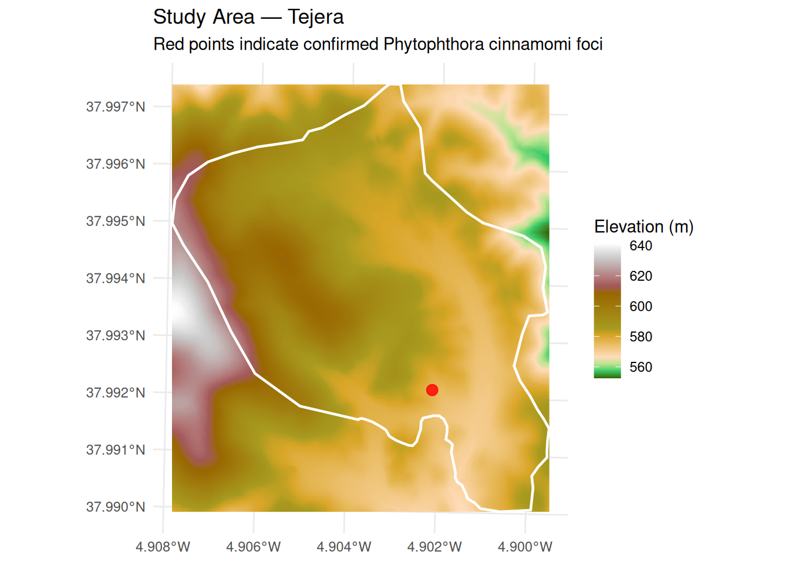
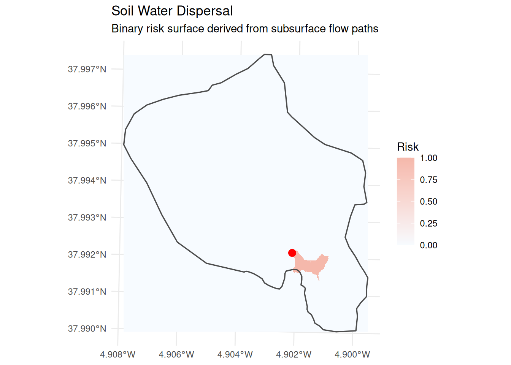
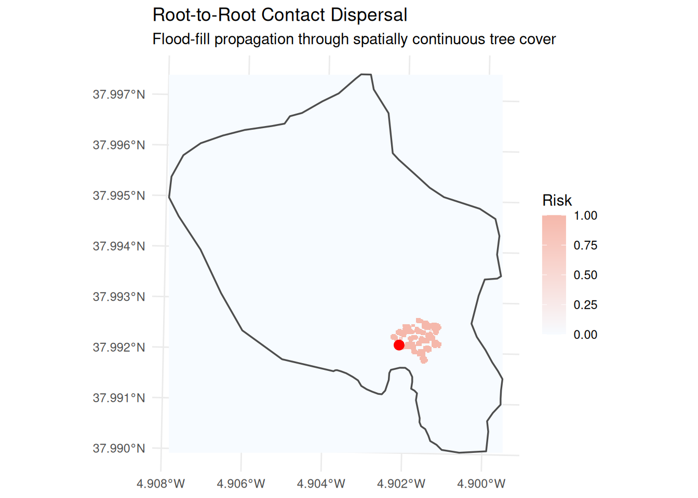
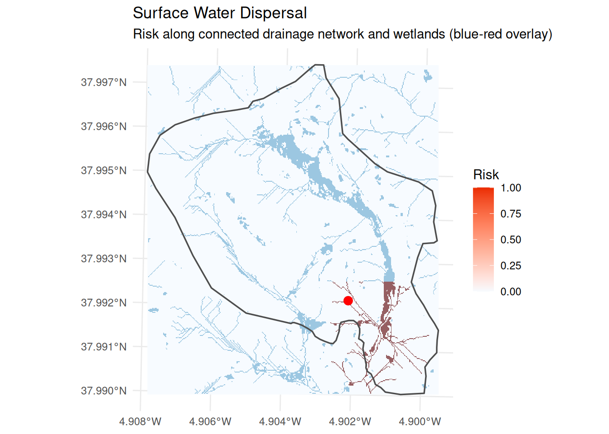
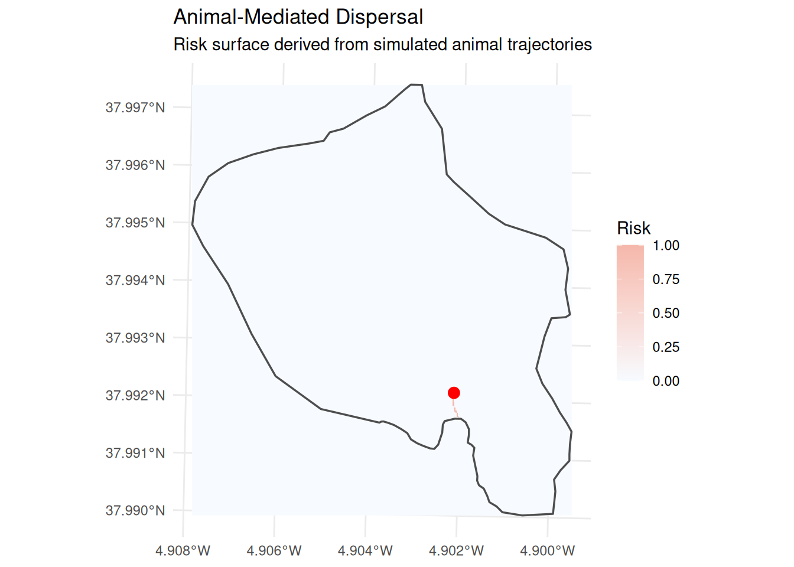
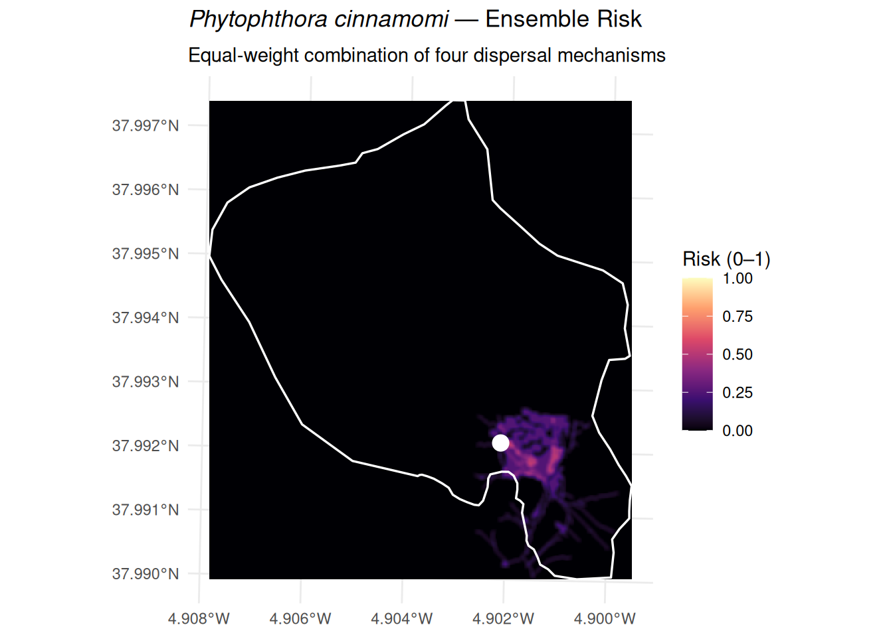

# Phytorisk Tutorial

## Introduction

*Phytophthora cinnamomi* (Pc) is an oomycete pathogen responsible for
one of the most widespread and destructive plant diseases in the world.
It causes root rot in thousands of susceptible plant species and has
been listed among the 100 worst invasive species globally by the IUCN.
Its spread is driven by four main dispersal mechanisms:

1.  **Soil water** — zoospores and mycelium are transported through the
    soil matrix following subsurface water flow paths.
2.  **Root-to-root contact** — mycelium grows directly from the root
    system of an infected tree into adjacent roots of susceptible hosts.
3.  **Surface water** — zoospores are carried by overland flow along
    streams, wetlands, and flooded areas.
4.  **Animal movement** — livestock, wild boar, and other animals
    mechanically transport infested soil on their hooves, fur, or
    digestive tract.

The `phytorisk` package models each mechanism separately and combines
the outputs into an ensemble invasion risk surface. This tutorial walks
through a complete analysis using the sample data bundled with the
package.

> **Note**
>
> To install the package and run this tutorial on your own machine,
> follow [these
> instructions](https://cidree.github.io/phytorisk/articles/index.md).

## Sample Data

The package ships with sample spatial data for the *Tejera* study area —
a forest stand where Pc presence has been confirmed. Load all inputs
upfront:

``` r

## study area polygon
aoi_sf <- st_read(
  system.file("spatial/tejera.geojson", package = "phytorisk"),
  quiet = TRUE
)

## known infection foci (points of interest)
poi_sf <- st_read(
  system.file("spatial/poi.geojson", package = "phytorisk"),
  quiet = TRUE
)

## digital elevation model
dem_sr <- rast(system.file("spatial/dem.tiff", package = "phytorisk"))

## tree cover raster
trees_sr <- rast(system.file("spatial/trees.tiff", package = "phytorisk"))
```

A quick look at the study area and infection foci:

Code

``` r

ggplot() +
  geom_spatraster(data = dem_sr) +
  scale_fill_hypso_c(
    name     = "Elevation (m)",
    na.value = "transparent"
  ) +
  geom_sf(
    data = aoi_sf, 
    fill = NA, 
    color = "white", 
    linewidth = 0.8
  ) +
  geom_sf(
    data = poi_sf, 
    color = "red", 
    size = 3, 
    shape = 21,
    fill = "red", 
    alpha = 0.8
  ) +
  labs(
    title = "Study Area — Tejera",
    subtitle = "Red points indicate confirmed Phytophthora cinnamomi foci",
    x = NULL, y = NULL
  ) +
  theme_minimal() +
  theme(legend.position = "right")
```



Figure 1

## Dispersal Mechanisms

### 1. Soil Water (`mec_soilwater`)

*Phytophthora cinnamomi* produces biflagellate zoospores that swim
actively in the soil water film. Under wet or intermediate moisture
conditions, the inoculum follows the same subsurface flow paths
determined by local topography. The function derives flow direction and
accumulation from the DEM using the D8 algorithm, then traces the wet
front downstream from each infection focus.

The `th` argument sets the flow-accumulation threshold used to delineate
streams (default: 100 contributing cells). The result is a two-layer
`SpatRaster`: `mec_soilwater` (binary risk) and `streams` (delineated
drainage network).

``` r

mec_soilwater_sr <- mec_soilwater(dem_sr, poi_sf, th = 100)
#> Loading required namespace: flowdem
#> ℹ Filling DEM...
#> ✔ DEM filled [152ms]
#> 
#> ℹ Filling basins...
#> ✔ Basins filled [73ms]
#> 
#> ℹ Removing depressions...
#> ✔ Depressions removed [94ms]
#> 
#> ℹ Filling depressions...
#> ✔ Depressions filled [57ms]
#> 
#> ℹ Getting flow directions...
#> ✔ Flow directions [35ms]
#> 
#> ℹ Calculating flow accumulation...
#> ✔ Flow accumulation calculated [38ms]
#> 
#> ℹ Delineating streams...
#> ✔ Streams delineated [20ms]
#> 
#> ℹ Determining the wet front
#> ✔ Wet front determined [7.3s]
#> 
mec_soilwater_sr
#> class       : SpatRaster
#> size        : 415, 366, 2  (nrow, ncol, nlyr)
#> resolution  : 2, 2  (x, y)
#> extent      : 332469, 333201, 4206413, 4207243  (xmin, xmax, ymin, ymax)
#> coord. ref. : ETRS89 / UTM zone 30N (EPSG:25830)
#> source(s)   : memory
#> varnames    : 
#>               dem
#> names       : mec_soilwater, streams
#> min values  :             0,       0
#> max values  :             1,       1
```

Code

``` r

ggplot() +
  geom_spatraster(data = mec_soilwater_sr["mec_soilwater"]) +
  geom_sf(data = aoi_sf, fill = NA, color = "grey30", linewidth = 0.6) +
  geom_sf(data = poi_sf, color = "red", size = 3) +
  scale_fill_gradient(
    low = "#F7FBFF", 
    high = "#F5B8AB",
    na.value = "transparent",
    name = "Risk"
  ) +
  labs(
    title = "Soil Water Dispersal",
    subtitle = "Binary risk surface derived from subsurface flow paths",
    x = NULL, y = NULL
  ) +
  theme_minimal()
```



Figure 2

### 2. Root-to-Root Contact (`mec_rootcontact`)

When tree roots from an infected individual come into physical contact
with the roots of a neighbouring host, mycelium can grow directly across
the junction. This mechanism depends entirely on spatial tree
continuity: if a gap exists between the crown projections of adjacent
trees (i.e., no pixel-to-pixel contact), the infection cannot spread via
this pathway.

The function uses a 3×3 focal window to identify connected tree-cover
pixels, then applies a flood-fill algorithm from each focus to trace all
pixels that are reachable through continuous root contact within the
study area.

``` r

mec_rootcontact_sr <- mec_rootcontact(trees_sr, aoi_sf, poi_sf)
#> ℹ Preparing tree data...
#> ✔ Tree data prepared [533ms]
#> 
#> ℹ Finding root-to-root contact...
#> ✔ Finished [4.1s]
#> 
mec_rootcontact_sr
#> class       : SpatRaster
#> size        : 415, 366, 1  (nrow, ncol, nlyr)
#> resolution  : 2, 2  (x, y)
#> extent      : 332469, 333201, 4206413, 4207243  (xmin, xmax, ymin, ymax)
#> coord. ref. : ETRS89 / UTM zone 30N (EPSG:25830)
#> source(s)   : memory
#> varname     : trees
#> name        : mec_rootcontact
#> min value   :               0
#> max value   :               1
```

``` r

ggplot() +
  geom_spatraster(data = mec_rootcontact_sr) +
  geom_sf(data = aoi_sf, fill = NA, color = "grey30", linewidth = 0.6) +
  geom_sf(data = poi_sf, color = "red", size = 3) +
  scale_fill_gradient(
    low = "#F7FBFF", high = "#F5B8AB",
    na.value = "transparent",
    name = "Risk"
  ) +
  labs(
    title = "Root-to-Root Contact Dispersal",
    subtitle = "Flood-fill propagation through spatially continuous tree cover",
    x = NULL, y = NULL
  ) +
  theme_minimal()
```



Figure 3

### 3. Surface Water (`mec_surfacewater`)

When the soil water front (Mechanism 1) reaches a stream or wetland,
zoospores enter the surface drainage network and are carried downstream.
The function identifies the nearest surface water body to the infection
focus and traces all connected surface water features. Wetlands are
detected using the Topographic Wetness Index (TWI; pixels above the 90th
percentile), which is combined with the drainage network from
`mec_soilwater`.

This function requires the output of
[`mec_soilwater()`](https://cidree.github.io/phytorisk/reference/mec_soilwater.md)
as an input, so always run that first.

``` r

mec_surface_lst <- mec_surfacewater(dem_sr, mec_soilwater_sr, poi_sf, buffer = 50)
#> ℹ Calculating natural drainage network...
#> ✔ Natural drainage network calculated [318ms]
#> 
#> ℹ Identifying surface water close to foci...
#> ✔ Surface water close to foci identified [45ms]
#> 
#> ℹ Finding connected pixels...
#> ✔ Finished [28.3s]
#> 

## the result is a list: the risk raster and the surface water polygon
names(mec_surface_lst)
#> [1] "mec_surfacewater" "surface_water"
```

Code

``` r

ggplot() +
  geom_spatraster(data = mec_surface_lst$mec_surfacewater) +
  geom_sf(data = mec_surface_lst$surface_water,
          fill = "#4393C3", color = NA, alpha = 0.5) +
  geom_sf(data = aoi_sf, fill = NA, color = "grey30", linewidth = 0.6) +
  geom_sf(data = poi_sf, color = "red", size = 3) +
  scale_fill_gradient(
    low = "#F7FBFF", high = "#eb2b00",
    na.value = "transparent",
    name = "Risk"
  ) +
  labs(
    title = "Surface Water Dispersal",
    subtitle = "Risk along connected drainage network and wetlands (blue-red overlay)",
    x = NULL, y = NULL
  ) +
  theme_minimal()
```



Figure 4

### 4. Animal-Mediated Dispersal (`mec_zoospread`)

Animals — particularly wild boar and livestock — can mechanically
transport Pc-infested soil on their hooves or fur. The function
simulates animal trajectories using a random-walk model: each animal
starts from a random position within the study area and moves
step-by-step towards a randomly selected surface-water feature (the
ecological attractant). Trajectories that pass within `dist` metres of
an infection focus are considered contaminated and contribute to the
risk surface.

Key parameters:

| Parameter    | Description                                         | Default |
|--------------|-----------------------------------------------------|---------|
| `n_animals`  | Number of simulated animals per iteration           | 5       |
| `n_steps`    | Steps per trajectory                                | 100     |
| `pixel_size` | Movement distance per step (in map units)           | 1       |
| `n_iter`     | Number of independent simulation runs               | 10      |
| `dist`       | Max distance from POI for a trajectory to count (m) | 5       |

> **Note**
>
> This is an optional, stochastic module. Increase `n_iter` for more
> stable results; the function returns `NULL` if no trajectory falls
> within `dist` metres of the focus.

``` r

mec_zoospread_sr <- mec_zoospread(
  aoi          = aoi_sf,
  poi          = poi_sf,
  mec_surfacewater = mec_surface_lst,
  n_animals    = 10,
  n_steps      = 50,
  pixel_size   = 1,
  n_iter       = 5,
  dist         = 10
)
#> 
#> ── Starting animal movement simulation ──
#> 
#> Simulating trajectories ■■■■■■■■■■■■■                     40% | ETA: 43s
#> Simulating trajectories ■■■■■■■■■■■■■■■■■■■               60% | ETA: 38s
#> Simulating trajectories ■■■■■■■■■■■■■■■■■■■■■■■■■         80% | ETA: 21s
#> Simulating trajectories ■■■■■■■■■■■■■■■■■■■■■■■■■■■■■■■  100% | ETA:  0s
#> ✔ Simulation completed. 5 trajectories generated.
#> ℹ Preparing results
#> ✔ Success [58ms]
#> 
mec_zoospread_sr
#> class       : SpatRaster
#> size        : 415, 366, 1  (nrow, ncol, nlyr)
#> resolution  : 2, 2  (x, y)
#> extent      : 332469, 333201, 4206413, 4207243  (xmin, xmax, ymin, ymax)
#> coord. ref. : ETRS89 / UTM zone 30N (EPSG:25830)
#> source(s)   : memory
#> varname     : dem
#> name        : mec_zoospread
#> min value   :             0
#> max value   :             1
```

Code

``` r

ggplot() +
  geom_spatraster(data = mec_zoospread_sr) +
  geom_sf(data = aoi_sf, fill = NA, color = "grey30", linewidth = 0.6) +
  geom_sf(data = poi_sf, color = "red", size = 3) +
  scale_fill_gradient(
    low = "#F7FBFF", high = "#F5B8AB",
    na.value = "transparent",
    name = "Risk"
  ) +
  labs(
    title = "Animal-Mediated Dispersal",
    subtitle = "Risk surface derived from simulated animal trajectories",
    x = NULL, y = NULL
  ) +
  theme_minimal()
```



Figure 5

## Ensemble Risk

The individual mechanism outputs are combined into a single invasion
risk surface using
[`phytorisk_ensemble()`](https://cidree.github.io/phytorisk/reference/phytorisk_ensemble.md).
By default, equal weights are assigned to each active mechanism:

\\ \text{Risk} = \sum\_{i=1}^{n} w_i \cdot \text{Mec}\_i, \quad w_i =
\frac{1}{n} \\

You can override this with a custom numeric vector that sums to 1. Here
we use equal weights across all four mechanisms, then compare with a
scenario that emphasises root-to-root contact and soil water pathways.

``` r

## equal weights (default)
ensemble_equal_sr <- phytorisk_ensemble(
  mec_soilwater    = mec_soilwater_sr,
  mec_rootcontact  = mec_rootcontact_sr,
  mec_surfacewater = mec_surface_lst,
  mec_zoospread    = mec_zoospread_sr
)
ensemble_equal_sr
#> class       : SpatRaster
#> size        : 415, 366, 1  (nrow, ncol, nlyr)
#> resolution  : 2, 2  (x, y)
#> extent      : 332469, 333201, 4206413, 4207243  (xmin, xmax, ymin, ymax)
#> coord. ref. : ETRS89 / UTM zone 30N (EPSG:25830)
#> source(s)   : memory
#> name        : ensemble_risk
#> min value   :             0
#> max value   :          0.75
```

``` r

## expert-informed weights: emphasise root contact and soil water
ensemble_weighted_sr <- phytorisk_ensemble(
  mec_soilwater    = mec_soilwater_sr,
  mec_rootcontact  = mec_rootcontact_sr,
  mec_surfacewater = mec_surface_lst,
  mec_zoospread    = mec_zoospread_sr,
  weights          = c(0.35, 0.35, 0.20, 0.10)
)
```

Code

``` r

ggplot() +
  geom_spatraster(data = ensemble_equal_sr) +
  geom_sf(data = aoi_sf, fill = NA, color = "white", linewidth = 0.6) +
  geom_sf(data = poi_sf, color = "white", size = 3, shape = 21,
          fill = "white", stroke = 1.2) +
  scale_fill_viridis_c(
    option = "magma",
    name = "Risk (0–1)",
    na.value = "transparent",
    limits = c(0, 1)
  ) +
  labs(
    title = expression(italic("Phytophthora cinnamomi") ~ "— Ensemble Risk"),
    subtitle = "Equal-weight combination of four dispersal mechanisms",
    x = NULL, y = NULL
  ) +
  theme_minimal() +
  theme(legend.position = "right")
```


Figure 6

## Smoothing the Result

Because each dispersal mechanism produces a binary raster (0 = no risk,
1 = risk), the raw ensemble surface has hard edges. Applying a Gaussian
focal filter replaces each pixel value with a weighted average of its
neighbourhood, where the weights decay with distance following a normal
distribution. This produces a continuous risk gradient that better
reflects the spatial uncertainty inherent in each mechanism and makes
the final map more interpretable.

The kernel is controlled by two parameters:

- **`size`** — the width (and height) of the neighbourhood window in
  pixels. A value of 5 means each output pixel is influenced by a 5×5
  block of input pixels.
- **`sigma`** (\\\sigma\\) — the standard deviation of the Gaussian,
  expressed in pixels. Larger values spread the influence further from
  the centre, producing a smoother surface at the cost of spatial
  precision.

The weights \\w\_{ij}\\ at row \\i\\, column \\j\\ of the kernel are:

\\ w\_{ij} = \frac{1}{Z} \exp\\\left(-\frac{(i - c)^2 + (j -
c)^2}{2\\\sigma^2}\right) \\

where \\c\\ is the centre index and \\Z\\ is a normalisation constant
that ensures the weights sum to 1. The normalised kernel is then passed
to
[`terra::focal()`](https://rspatial.github.io/terra/reference/focal.html)
with `fun = "sum"`, which is equivalent to a weighted mean.

``` r

## Function to create a Gaussian kernel
gaussian_kernel <- function(size, sigma) {
  k <- floor(size / 2)
  mat <- matrix(0, size, size)
  for (i in 1:size) for (j in 1:size) {
    mat[i, j] <- exp(-((i - k - 1)^2 + (j - k - 1)^2) / (2 * sigma^2))
  }
  mat / sum(mat)
}

## Generate a 5×5 Gaussian kernel (sigma = 2) and apply focal smoothing
w <- gaussian_kernel(size = 5, sigma = 2)
ensemble_smooth_sr <- focal(ensemble_equal_sr, w = w, fun = "sum", na.rm = TRUE)
```

Code

``` r

ggplot() +
  geom_spatraster(data = ensemble_smooth_sr) +
  geom_sf(data = aoi_sf, fill = NA, color = "white", linewidth = 0.6) +
  geom_sf(data = poi_sf, color = "white", size = 3, shape = 21,
          fill = "white", stroke = 1.2) +
  scale_fill_viridis_c(
    option = "magma",
    name = "Risk (0–1)",
    na.value = "transparent",
    limits = c(0, 1)
  ) +
  labs(
    title = expression(italic("Phytophthora cinnamomi") ~ "— Ensemble Risk"),
    subtitle = "Equal-weight combination of four dispersal mechanisms",
    x = NULL, y = NULL
  ) +
  theme_minimal() +
  theme(legend.position = "right")
```



Figure 7
